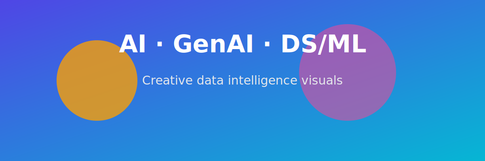

# python-learning-notes

This repository contains my daily Python practice notebooks as I learn the language from scratch. Each notebook covers concepts with examples, exercises, and notes
## AI / GenAI / DS-ML Banner

